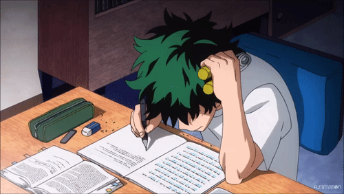

  

#

 Sou estudante de Análise e Desenvolvimento de Sistemas e estou finalizando o curso de Técnico em Informática. Estou sempre em busca de novos desafios e oportunidades para expandir meus conhecimentos e habilidades, principalmente em programação, desenvolvimento de software e tecnologias emergentes.

#

<h3 align="left">Connect with me!</h3>

<h3 align="left">My Stack ~</h3>

  
  
  
  
  
  
  
  
  
  
  

#

<picture align="center">
  <source media="(prefers-color-scheme: dark)" srcset="https://raw.githubusercontent.com/mari4souza/mari4souza/output/github-contribution-grid-snake-dark.svg">
  <source media="(prefers-color-scheme: light)" srcset="https://raw.githubusercontent.com/mari4souza/mari4souza/output/github-contribution-grid-snake-dark.svg">
  
</picture>
